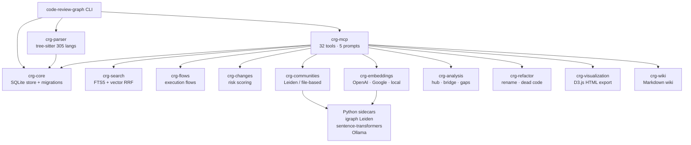

<div align="center">

# code-review-graph

Persistent, incrementally updated knowledge graph for token-efficient code review

[](LICENSE)
[](https://www.rust-lang.org)
[](#)
[](#mcp-server)
[](https://github.com/rushikeshsakharleofficial/code-review-graph-rs/stargazers)

</div>

## What is this?

A high-performance Rust CLI and MCP server that parses your codebase with tree-sitter, stores a structural graph in SQLite, and exposes compact context to AI coding tools. Drop-in replacement for the Python `code-review-graph` with the same SQLite schema (v9), same CLI flags, and same MCP tool names — but faster cold starts and lower memory use.

Supports Claude Code, Cursor, Windsurf, Zed, Continue, OpenCode, Gemini CLI, Kiro, and GitHub Copilot via the Model Context Protocol.

## Quick Start

```bash
# Build
cargo build --release

# Build a knowledge graph for the current repo
code-review-graph build

# Show graph stats
code-review-graph status

# Start the MCP server (stdio transport — wire this into your AI tool config)
code-review-graph serve
```

**Install system-wide (deb/rpm):**

```bash
# Build packages
./scripts/package.sh

# Debian/Ubuntu
sudo dpkg -i target/packages/code-review-graph_*.deb

# RHEL/Fedora/Rocky
sudo rpm -i target/packages/code-review-graph-*.rpm
```

## Architecture



## Project Structure

```
code-review-graph-new/
├── crates/
│   ├── crg-analysis/       Hub/bridge nodes, knowledge gaps
│   ├── crg-changes/        Risk-scored change impact analysis
│   ├── crg-cli/            15 CLI subcommands (main binary)
│   ├── crg-communities/    Community detection (Leiden + file-based)
│   ├── crg-core/           SQLite store, migrations v1–v9, security
│   ├── crg-embeddings/     Vector embeddings (local / OpenAI / Google / MiniMax)
│   ├── crg-flows/          Execution flow detection, criticality scoring
│   ├── crg-mcp/            MCP server — 32 tools + 5 prompts (crg-mcp binary)
│   ├── crg-parser/         tree-sitter AST walker, 305 languages
│   ├── crg-refactor/       Rename preview, dead code, suggestions
│   ├── crg-search/         FTS5 + vector hybrid search (RRF merge)
│   ├── crg-sidecar-bridge/ Length-prefixed JSON IPC to Python processes
│   ├── crg-visualization/  D3.js force graph HTML export
│   └── crg-wiki/           Markdown wiki from community structure
├── packaging/
│   └── code-review-graph.service   Systemd unit
├── python-sidecars/
│   ├── crg_embeddings_sidecar.py   sentence-transformers
│   ├── crg_leiden_sidecar.py       igraph Leiden community detection
│   └── crg_ollama_sidecar.py       Ollama wiki generation
└── scripts/
    ├── diff-test.sh        Python ↔ Rust graph parity harness
    └── package.sh          Build .deb and .rpm packages
```

## CLI Reference

| Command | Description |
|---------|-------------|
| `build` | Full graph build from scratch |
| `update` | Incremental update for changed files |
| `status` | Node/edge counts, languages, last updated |
| `serve` / `mcp` | Start MCP server on stdio |
| `visualize` | Generate interactive D3.js HTML |
| `wiki` | Generate Markdown wiki from communities |
| `detect-changes` | Risk-scored analysis of recent git changes |
| `register <path>` | Register a repo in the multi-repo registry |
| `unregister` | Remove a repo from the registry |
| `repos` | List registered repos |
| `postprocess` | Rebuild FTS, recompute flows/communities |
| `install` | Print MCP config for Claude Code, Cursor, etc. |
| `daemon start\|stop\|status` | Background file-watching daemon |
| `eval` | Run evaluation benchmarks |

## MCP Server

The `crg-mcp` binary speaks the [Model Context Protocol](https://modelcontextprotocol.io) over stdio. Configure it in your AI tool as:

```json
{
  "mcpServers": {
    "code-review-graph": {
      "command": "crg-mcp",
      "env": { "CRG_REPO_ROOT": "/path/to/your/repo" }
    }
  }
}
```

Or let the CLI generate the config for your platform:

```bash
code-review-graph install --platform claude-code
code-review-graph install --platform cursor
code-review-graph install --platform windsurf
```

### Key tools

| Tool | Purpose |
|------|---------|
| `get_minimal_context` | ~100-token task-oriented summary (start here) |
| `semantic_search_nodes` | Full-text + vector search over symbols |
| `get_impact_radius` | BFS blast-radius of a changed symbol |
| `detect_changes` | Risk-scored diff analysis |
| `query_graph` | Callers, callees, imports, tests for a symbol |
| `get_affected_flows` | Execution paths impacted by a change |
| `get_architecture_overview` | High-level community map |
| `refactor_tool` | Rename preview, dead code detection |

## Python Sidecars

Three optional sidecars extend functionality that has no pure-Rust equivalent:

```bash
pip install -r python-sidecars/requirements.txt
```

| Sidecar | Activates |
|---------|-----------|
| `crg_embeddings_sidecar.py` | Local vector embeddings via sentence-transformers |
| `crg_leiden_sidecar.py` | High-quality community detection (igraph Leiden) |
| `crg_ollama_sidecar.py` | AI-generated wiki summaries via Ollama |

Sidecars are optional — the graph builds and all MCP tools work without them, falling back to keyword search, file-based communities, and template wiki text.

## Development

```bash
# Run tests
cargo test --workspace

# Lint
cargo clippy --all-targets --all-features

# Differential parity test (Python vs Rust graph output)
./scripts/diff-test.sh

# Build packages
./scripts/package.sh          # both .deb and .rpm
./scripts/package.sh --deb-only
./scripts/package.sh --rpm-only
```

## License

MIT — see [LICENSE](LICENSE).
